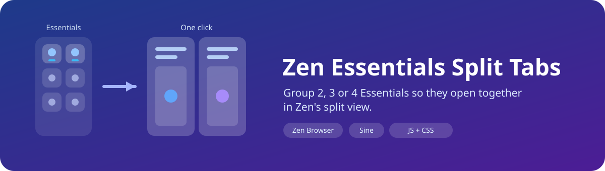
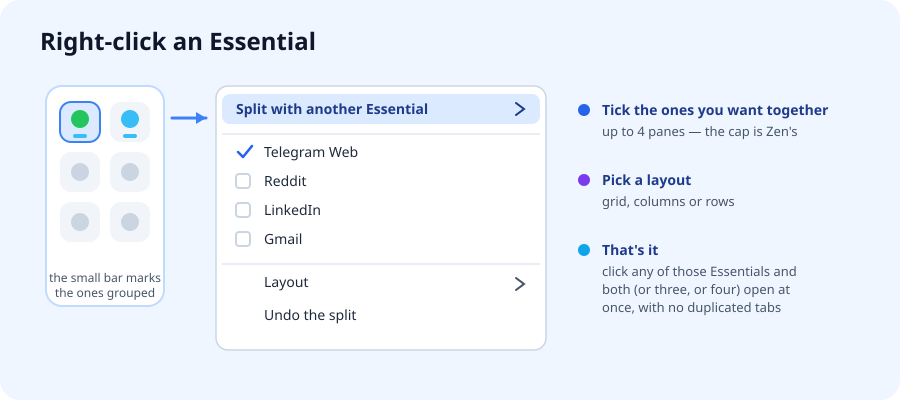
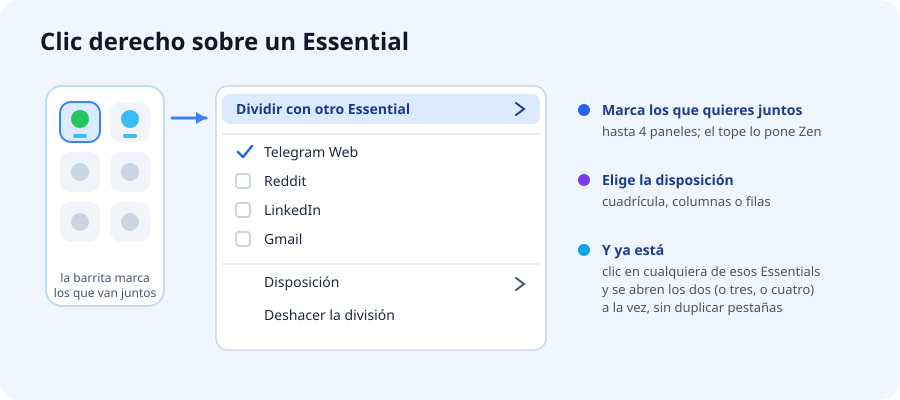
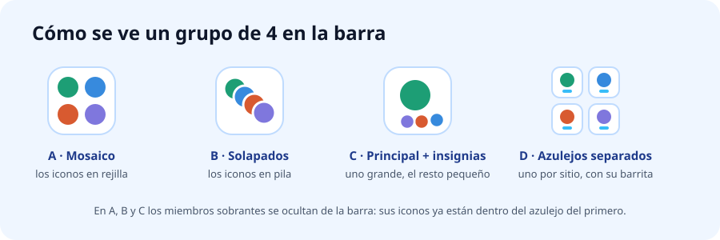

<div align="center">



# Zen Essentials Split Tabs

**Group 2, 3 or 4 Essentials so they open together in Zen's split view.**

**Agrupa 2, 3 o 4 Essentials para que se abran juntos en la vista dividida de Zen.**


### [English](#english) · [Español](#español)

</div>

---

## English

### ✨ What it does

WhatsApp *and* Telegram. Facebook, Reddit *and* LinkedIn. Some things you always want side by side — but Zen's split view refuses to work with Essentials: try it and Zen silently **duplicates** them into loose regular tabs.

This mod fixes that. You tick which Essentials belong together and, from then on, **clicking any of them opens all of them at once**, split, in the content area. No duplicated tabs, no Essentials leaving the sidebar.

- **2, 3 or 4 Essentials** per group (4 is Zen's own cap).
- **Grid, columns or rows** — pick the layout per group.
- **Several groups at the same time**: WhatsApp + Telegram in one, Reddit + LinkedIn + X in another.
- **Remembered across restarts**, which Zen's own session store does not do for Essentials.
- **One tile for the whole group**: the members collapse into a single square that shows all their favicons, instead of eating one slot each.

Unlike [zen-essentials-compact](https://github.com/piero-valles-maravi/zen-essentials-compact), this one **needs JavaScript** — see [How it works](#-how-it-works) for why, and for exactly what it touches.



### 📋 Requirements

- **[Zen Browser](https://zen-browser.app/)** with the vertical sidebar and at least two Essentials.
- **[Sine](https://github.com/CosmoCreeper/Sine)**, the Zen mod manager.
- **Sine's "Allow unsafe JS" turned on.** Sine refuses to run JavaScript from mods installed straight from a GitHub repo unless you allow it. See the next section — **without this the mod does nothing at all.**

### 🚀 Installation

#### 1. Allow JS mods in Sine (one time only)

1. In Zen open **Settings → Sine Mods**.
2. At the top, in *General*, tick **"Allow unsafe JS"** (pref `sine.allow-unsafe-js`).

> Sine only auto-trusts JavaScript from its own marketplace. Mods added by repo — like this one — stay inert until you flip that switch. It applies to every repo-installed JS mod, not just this one.

#### 2. Install the mod

1. Still in **Settings → Sine Mods**, under *Marketplace*, find the field **"or, add your own locally from a GitHub repo"**.
2. Paste this identifier and click **Install**:
   ```
   piero-valles-maravi/zen-essentials-split-tabs
   ```
3. Restart Zen. The mod shows up under *Installed Mods* with its preferences.

> The full URL works too (`https://github.com/piero-valles-maravi/zen-essentials-split-tabs`).

> ⚠️ Dropping the folder into `chrome/sine-mods/` **does not work**: Sine only loads mods registered in its `mods.json`.

### 🖱️ Usage

**Create a group**

1. **Right-click** one of the Essentials you want to pair.
2. Open **"Split with another Essential"**.
3. **Tick** the other Essentials you want with it — up to 3 more.

The split opens straight away. From now on, clicking any member of the group brings the whole split back.

**Change the layout** — same menu → *Layout* → Grid / Side by side / Stacked.

**Remove one** — same menu, untick it. Drop below two members and the group disappears.

**Undo the whole thing** — same menu → *Undo the split*. Zen's own unsplit button on the pane header works too.

**Shortcut**: `Ctrl`-click (`Cmd` on macOS) 2–4 Essentials to multi-select them, then right-click → **"Split the N selected Essentials"**.

### 🧩 One tile per group

A group of 4 used to eat 4 slots in the sidebar. By default it now takes **one**: the first member keeps its square and all the favicons are drawn inside it; the rest are hidden from the strip. Four styles to choose from in the preferences:


**The mosaic is a faithful miniature.** It is not a fixed grid of icons: each favicon sits where its pane actually is. Split into columns and the icons sit side by side; stack the panes and the icons stack too; drag a pane from left to right and the icons swap with it; resize a pane and its icon grows or shrinks with it. Everything is measured in percentages, so the tile holds at any sidebar width — and on the square tiles of [zen-essentials-compact](https://github.com/piero-valles-maravi/zen-essentials-compact).

> **What you give up with A, B and C.** Hidden members can't be clicked on their own, so the tile always opens the whole split, and Zen's per-app unread and notification marks only show for the tile's owner. If that matters more than the space, pick **D · Separate tiles** — it keeps every Essential clickable and only adds the little bar.

### 🎛️ Preferences

| Preference | Default | What it does |
|---|---|---|
| **How a group looks in the sidebar** | `Mosaic` | Mosaic, stacked, main + badges, or separate tiles. See [One tile per group](#-one-tile-per-group). |
| **Mark which Essentials are grouped** | on | The bar under the icon in *separate* mode, and the outline around the tile when that group is the one on screen. Off: no mark at all. |
| **Mark colour** | `#38BDF8` | Any CSS colour. Hidden when the mark is off. |
| **Dot size** | `5` | Height in px, plain number. Only applies to *separate* mode, so it is hidden in the other three. |
| **Default layout for new splits** | `Grid` | Layout new groups are born with. *Grid* is automatic (with 2 panes it is the same as columns); *columns* puts them side by side; *rows* stacks them. |
| **Remember splits across restarts** | on | Saves your groups and rebuilds them a moment after Zen starts. Off: groups last only for the session. |
| **Log diagnostics** | off | Writes what the mod does to the browser console. Only useful when reporting a bug. |

### 🔧 How it works

Worth reading if you are going to trust a JS mod with your browser chrome.

**The obstacle.** Zen deliberately blocks splitting Essentials. In `ZenViewSplitter.splitTabs()` there is a literal `TODO: Add support for splitting essential tabs`, and the private `#useTabsToSplit()` **duplicates** every pinned tab as soon as it spots an Essential in the list. That is why the native split gives you copies instead of your Essentials.

**What the mod does about it** — three pieces, none of them destructive:

1. **Masks the `zen-essential` attribute** for the duration of the call. It does *not* remove it from the DOM (that would fire Zen's observers and yank the tab out of the sidebar): it puts an own `hasAttribute()` on those specific elements that lies about that one attribute and delegates everything else to the original. It is removed in a `finally`.
2. **Keeps `_getSplitViewGroup()` returning `null`.** Zen already returns `null` when it sees an Essential — Essentials must not go into a tab group or they leave the sidebar. The override just holds that decision while the mask is on.
3. **Absorbs the side effect.** With no tab group, Zen throws at the *end* of `splitTabs()` when it dispatches an event on a group that does not exist. By then the split is already applied, so the mod catches it and verifies the result by reading `gZenViewSplitter._data` instead of trusting the return value.

Everything else — layout, resizing, closing a pane, the unsplit button on the header — is still plain Zen. The mod only opens the door, adds the menu and remembers the groups.

**Persistence.** Zen's session store saves splits by tab-group id, and ours have no tab group, so they would be lost. The mod keeps its own list in the pref `zen-essentials-split.saved-groups`, identifying each Essential by *container + site origin*, and rebuilds the groups a moment after `AfterWorkspacesSessionRestore` — without stealing the screen.

**The combined tile.** Zen already stores each Essential's favicon as `--zen-essential-tab-icon` in the tab's inline style. The script reads them and paints one `<span>` per favicon inside a `div.zes-overlay` it injects into the tile's `.tab-stack`; `chrome.css` only defines how those spans look. The other members get `display: none` — they are neither closed nor unloaded, they just stop taking up space. Unloading the mod removes all of it, so no Essential is ever left hidden.

Three details that are easy to get wrong, and that the mod handles explicitly:

- **Why an injected layer instead of pseudo-elements.** With `zen.theme.essentials-favicon-bg` — on by default — Zen claims *both* pseudo-elements of `.tab-background` as soon as the Essential is `[visuallyselected]`: `::before` is the opaque selected-tab plate and `::after` the blurred favicon backdrop. Its `inset: 0` overrides the slot's position and its `background` overrides the image, so icons drawn there vanish the moment you click the tile. An element of our own shares nothing with Zen.
- **Where each icon goes.** `group.tabs` is the *creation* order and never changes when you rearrange panes. The real order and geometry live in `group.layoutTree`, where Zen writes a `positionToRoot` on every leaf — the four margins of that pane as percentages, which it uses to place the browsers. The mosaic reads those, which is why it tracks reordering and resizing for free.
- **Favicons that vanish for an instant.** Zen's `setEssentialTabIcon()` does `getAttribute("image") ?? ""`, so while a tab is loading it literally writes `url()`. The mod treats an empty `url()` as no icon, falls back to the tab's `image` attribute, and keeps the last good favicon per tab.

### 📝 Notes and limitations

- **Essentials only.** Mixing an Essential with a regular tab is not supported here — Zen's own *Split tabs* already does that.
- **4 panes maximum**, because `gZenViewSplitter.MAX_TABS` is 4. Not a decision of this mod.
- **Two Essentials on the same site and container can't be told apart** when restoring a session, since the saved key is container + origin. Rare, but if you keep two accounts of the same site as separate Essentials, the group may come back with the wrong one.
- **Hidden members lose their individual marks.** In the mosaic, stacked and badge modes, Zen's unread and notification indicators only remain visible for the Essential that owns the tile. With messaging apps this is the real cost of the space you gain — *separate tiles* mode avoids it.
- **It rides on Zen internals.** A Zen release that reworks `ZenViewSplitter` can break it. If that happens, disabling the mod restores stock behaviour with nothing left behind: both the patch and the combined tiles are removed on unload.
- **Compatible with [zen-essentials-compact](https://github.com/piero-valles-maravi/zen-essentials-compact)** — one changes the shape of the tiles, the other what happens when you click them. The combined tile is laid out in percentages, so it follows the square tiles at any size.
- **Also using SuperPins?** It can restyle Essentials too. If the indicator ends up misplaced, adjust the spacing from only one of the two mods.

### 🔄 Updating

Sine detects new versions by the **repository's last-change date**, not by the version number.

- With **Auto-Update** on, it updates by itself.
- Otherwise, click **Check for Updates** under *Installed Mods*.
- If the preferences changed between versions, **reinstall** the mod so Sine registers the new ones.

### 👤 Author · License

Created by **[@piero-valles-maravi](https://github.com/piero-valles-maravi)**.

Released under the **[MIT](LICENSE)** license — use it, modify it and share it freely, keeping the copyright notice.

---

## Español

### ✨ ¿Qué hace?

WhatsApp *y* Telegram. Facebook, Reddit *y* LinkedIn. Hay cosas que uno quiere siempre lado a lado — pero la vista dividida de Zen se niega a trabajar con Essentials: si lo intentas, Zen los **duplica** en silencio y te deja pestañas sueltas.

Este mod lo arregla. Marcas qué Essentials van juntos y, a partir de ahí, **un clic en cualquiera de ellos abre todos a la vez**, divididos, en el área de contenido. Sin pestañas duplicadas y sin que ningún Essential salga de la barra lateral.

- **2, 3 o 4 Essentials** por grupo (el 4 es el tope del propio Zen).
- **Cuadrícula, columnas o filas** — la disposición se elige por grupo.
- **Varios grupos a la vez**: WhatsApp + Telegram en uno, Reddit + LinkedIn + X en otro.
- **Se recuerdan al reiniciar**, cosa que el session store de Zen no hace con Essentials.
- **Un solo azulejo por grupo**: los miembros se colapsan en un cuadrado que muestra todos sus favicons, en vez de ocupar una casilla cada uno.

A diferencia de [zen-essentials-compact](https://github.com/piero-valles-maravi/zen-essentials-compact), este **necesita JavaScript** — en [Cómo funciona](#-cómo-funciona) está el porqué y exactamente qué toca.



### 📋 Requisitos

- **[Zen Browser](https://zen-browser.app/)** con la barra lateral vertical y al menos dos Essentials.
- **[Sine](https://github.com/CosmoCreeper/Sine)**, el gestor de mods de Zen.
- **La opción "Allow unsafe JS" de Sine activada.** Sine se niega a ejecutar JavaScript de mods instalados desde un repo de GitHub salvo que lo permitas. Está en el paso siguiente — **sin eso el mod no hace absolutamente nada.**

### 🚀 Instalación

#### 1. Permitir mods con JS en Sine (una sola vez)

1. En Zen abre **Ajustes → Sine Mods**.
2. Arriba, en *General*, marca **"Allow unsafe JS"** (preferencia `sine.allow-unsafe-js`).

> Sine solo confía automáticamente en el JavaScript de su propio marketplace. Los mods añadidos por repo — como este — quedan inertes hasta que actives esa casilla. Aplica a todos los mods con JS instalados por repo, no solo a este.

#### 2. Instalar el mod

1. En la misma pantalla, en *Marketplace*, busca el campo **"or, add your own locally from a GitHub repo"**.
2. Pega este identificador y pulsa **Install**:
   ```
   piero-valles-maravi/zen-essentials-split-tabs
   ```
3. Reinicia Zen. El mod aparece en *Installed Mods* con sus preferencias.

> También funciona pegando la URL completa (`https://github.com/piero-valles-maravi/zen-essentials-split-tabs`).

> ⚠️ **No sirve** copiar la carpeta dentro de `chrome/sine-mods/`: Sine solo carga los mods registrados en su `mods.json`.

### 🖱️ Uso

**Crear un grupo**

1. **Clic derecho** sobre uno de los Essentials que quieres emparejar.
2. Abre **"Dividir con otro Essential"**.
3. **Marca** los otros Essentials que quieres con él — hasta 3 más.

La división se abre al instante. A partir de ahí, un clic en cualquier miembro del grupo la trae de vuelta.

**Cambiar la disposición** — mismo menú → *Disposición* → Cuadrícula / Lado a lado / Arriba y abajo.

**Quitar uno** — mismo menú, lo desmarcas. Si quedan menos de dos, el grupo desaparece.

**Deshacer todo** — mismo menú → *Deshacer la división*. El botón de deshacer de la cabecera del panel, el de Zen, también sirve.

**Atajo**: `Ctrl`+clic (`Cmd` en macOS) sobre 2–4 Essentials para multiseleccionarlos, y luego clic derecho → **"Dividir los N Essentials seleccionados"**.

### 🧩 Un azulejo por grupo

Un grupo de 4 ocupaba 4 casillas de la barra. Por defecto ahora ocupa **una**: el primer miembro se queda con su cuadrado y dentro se dibujan todos los favicons; el resto desaparece de la barra. Cuatro estilos a elegir en las preferencias:



**El mosaico es una miniatura fiel.** No es una rejilla fija de iconos: cada favicon va donde está su panel de verdad. Si divides en columnas, los iconos van lado a lado; si apilas los paneles, los iconos se apilan; si arrastras un panel de izquierda a derecha, los iconos se intercambian con él; si estiras un panel, su icono crece. Todo está medido en porcentajes, así que el azulejo aguanta cualquier ancho de barra lateral — y los azulejos cuadrados de [zen-essentials-compact](https://github.com/piero-valles-maravi/zen-essentials-compact).

> **Qué se pierde con A, B y C.** Los miembros ocultos ya no se pueden abrir por separado, así que el azulejo siempre abre la división entera, y los avisos de no leídos y notificaciones de Zen solo se ven en el Essential dueño del azulejo. Si eso te pesa más que el espacio, elige **D · Azulejos separados**: conserva cada Essential clicable y solo añade la barrita.

### 🎛️ Preferencias

| Preferencia | Por defecto | Qué hace |
|---|---|---|
| **Cómo se ve un grupo en la barra** | `Mosaico` | Mosaico, solapados, principal + insignias, o azulejos separados. Ver [Un azulejo por grupo](#-un-azulejo-por-grupo). |
| **Marcar los Essentials agrupados** | activado | La barrita bajo el icono en el modo *separados*, y el borde alrededor del azulejo cuando ese grupo es el que está en pantalla. Desactivado: ninguna marca. |
| **Color de la marca** | `#38BDF8` | Cualquier color CSS. Se oculta si la marca está apagada. |
| **Tamaño del punto** | `5` | Alto en px, solo el número. Solo aplica al modo *separados*, así que se oculta en los otros tres. |
| **Disposición por defecto** | `Cuadrícula` | Con qué disposición nacen los grupos nuevos. *Cuadrícula* es automática (con 2 paneles equivale a columnas); *columnas* los pone lado a lado; *filas* los apila. |
| **Recordar las divisiones al reiniciar** | activado | Guarda tus grupos y los rehace poco después de arrancar Zen. Desactivado: los grupos duran solo la sesión. |
| **Mensajes de diagnóstico** | desactivado | Escribe en la consola del navegador lo que va haciendo el mod. Útil solo para reportar un fallo. |

### 🔧 Cómo funciona

Vale la pena leerlo si vas a darle permiso a un mod con JS sobre el chrome de tu navegador.

**El obstáculo.** Zen bloquea a propósito la división de Essentials. En `ZenViewSplitter.splitTabs()` hay un `TODO: Add support for splitting essential tabs` literal, y el método privado `#useTabsToSplit()` **duplica** cualquier pestaña fijada en cuanto detecta un Essential en la lista. Por eso la división nativa te da copias en vez de tus Essentials.

**Qué hace el mod al respecto** — tres piezas, ninguna destructiva:

1. **Enmascara el atributo `zen-essential`** mientras dura la llamada. *No* lo quita del DOM (eso dispararía los observadores de Zen y sacaría la pestaña de la barra): le pone a esos elementos concretos un `hasAttribute()` propio que miente solo sobre ese atributo y delega todo lo demás en el original. Se retira en un `finally`.
2. **Sostiene que `_getSplitViewGroup()` devuelva `null`.** Zen ya devuelve `null` cuando ve un Essential — los Essentials no deben entrar en un tab-group o saldrían de la barra. El override solo mantiene esa decisión mientras la máscara está puesta.
3. **Absorbe el efecto colateral.** Sin tab-group, Zen lanza una excepción al *final* de `splitTabs()` al despachar un evento sobre un grupo que no existe. Para entonces la división ya está aplicada, así que el mod la atrapa y verifica el resultado leyendo `gZenViewSplitter._data` en vez de fiarse del valor de retorno.

Todo lo demás — layout, redimensionar, cerrar un panel, el botón de deshacer de la cabecera — sigue siendo Zen puro. El mod solo abre la puerta, pone el menú y recuerda los grupos.

**Persistencia.** El session store de Zen guarda las divisiones por el id del tab-group, y las nuestras no tienen tab-group: se perderían. El mod lleva su propia lista en la preferencia `zen-essentials-split.saved-groups`, identificando cada Essential por *contenedor + origen del sitio*, y rehace los grupos poco después de `AfterWorkspacesSessionRestore` — sin robar la pantalla.

**El azulejo combinado.** Zen ya guarda el favicon de cada Essential como `--zen-essential-tab-icon` en el estilo inline de la pestaña. El script los lee y pinta un `<span>` por favicon dentro de un `div.zes-overlay` que inyecta en el `.tab-stack` del azulejo; `chrome.css` solo define el aspecto de esos spans. A los demás miembros les pone `display: none`: no se cierran ni se descargan, solo dejan de ocupar sitio. Al descargar el mod se retira todo, así que ningún Essential queda oculto.

Tres detalles fáciles de equivocar, y que el mod resuelve a propósito:

- **Por qué una capa inyectada y no pseudoelementos.** Con `zen.theme.essentials-favicon-bg` —activada de serie— Zen se queda con *los dos* pseudoelementos de `.tab-background` en cuanto el Essential está `[visuallyselected]`: `::before` es la placa opaca del fondo seleccionado y `::after` el favicon desenfocado. Su `inset: 0` pisa la posición de la ranura y su `background` pisa la imagen, así que los iconos dibujados ahí desaparecen en cuanto haces clic en el azulejo. Con un elemento propio no hay nada que compartir con Zen.
- **Dónde va cada icono.** `group.tabs` es el orden de *creación* y no cambia al reordenar paneles. El orden y la geometría reales están en `group.layoutTree`, donde Zen escribe en cada hoja un `positionToRoot` con los cuatro márgenes de ese panel en porcentajes — los mismos que usa para colocar los browsers. El mosaico los lee, y por eso sigue solo a los cambios de orden y de tamaño.
- **Favicons que desaparecen un instante.** `setEssentialTabIcon()` de Zen hace `getAttribute("image") ?? ""`, así que mientras una pestaña carga escribe literalmente `url()`. El mod trata un `url()` vacío como "sin icono", prueba el atributo `image` de la pestaña, y recuerda el último favicon bueno de cada una.

### 📝 Notas y limitaciones

- **Solo entre Essentials.** Mezclar un Essential con una pestaña normal no entra aquí — para eso ya está la opción nativa *Dividir pestañas* de Zen.
- **Máximo 4 paneles**, porque `gZenViewSplitter.MAX_TABS` vale 4. No es una decisión de este mod.
- **Dos Essentials del mismo sitio y contenedor no se distinguen** al restaurar la sesión, porque la clave guardada es contenedor + origen. Es raro, pero si tienes dos cuentas del mismo sitio como Essentials separados, el grupo puede volver con el que no era.
- **Los miembros ocultos pierden sus marcas individuales.** En los modos mosaico, solapados e insignias, los avisos de no leídos y notificaciones de Zen solo se ven en el Essential dueño del azulejo. Con apps de mensajería ese es el coste real del espacio que ganas; el modo *azulejos separados* lo evita.
- **Se apoya en las tripas de Zen.** Una versión de Zen que reescriba `ZenViewSplitter` puede romperlo. Si pasa, desactivar el mod devuelve el comportamiento original sin dejar rastro: se retiran tanto el parche como los azulejos combinados.
- **Compatible con [zen-essentials-compact](https://github.com/piero-valles-maravi/zen-essentials-compact)** — uno cambia la forma de los azulejos y el otro lo que pasa al hacer clic. El azulejo combinado está medido en porcentajes, así que sigue a los cuadrados a cualquier tamaño.
- **¿Usas también SuperPins?** También puede reestilizar los Essentials. Si el indicador queda descolocado, ajusta el espaciado desde uno solo de los dos mods.

### 🔄 Actualización

Sine detecta versiones nuevas por la **fecha del último cambio del repositorio**, no por el número de versión.

- Con **Auto-Update** activado se actualiza solo.
- Si no, pulsa **Check for Updates** en *Installed Mods*.
- Si cambiaron las preferencias entre versiones, **reinstala** el mod para que Sine registre las nuevas.

### 👤 Autor · Licencia

Creado por **[@piero-valles-maravi](https://github.com/piero-valles-maravi)**.

Publicado bajo la licencia **[MIT](LICENSE)** — puedes usarlo, modificarlo y compartirlo libremente, conservando el aviso de copyright.
